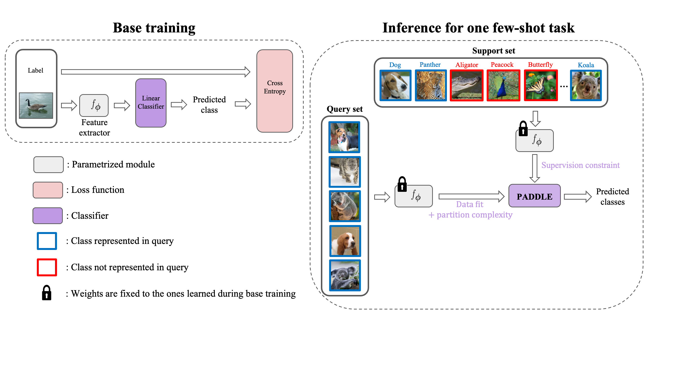
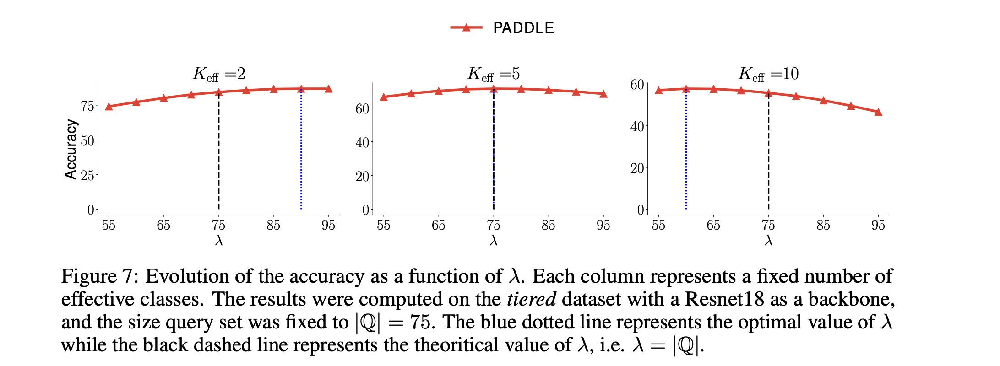
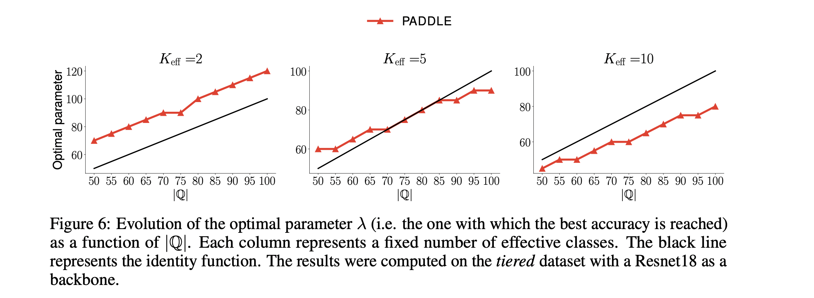
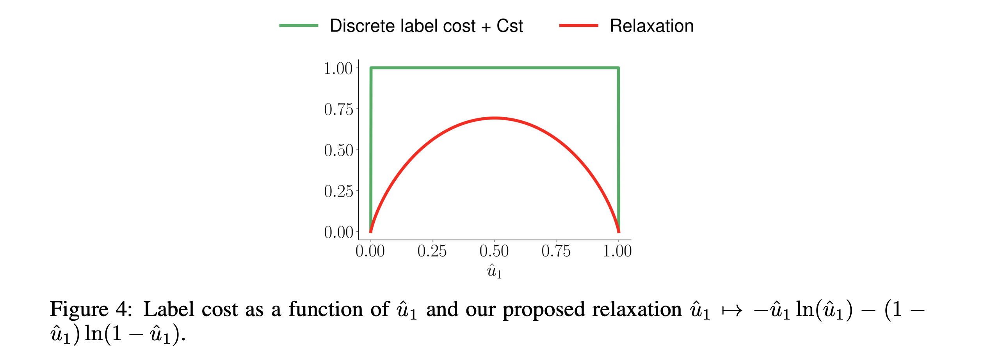

#  Figure A - General framework for our few-shot learning method

#  Table B - Evaluation of additional baselines (SIB, FEAT, DPGN) 
## On Mini-Imagenet

<table>
  <thead>
    <tr>
      <th>Method</th>
      <th>5-shot</th>
      <th>10-shot</th>
	<th>20-shot</th>
    </tr>
  </thead>
  <body>
    <tr>
      <th>FEAT [1]</td>
      <td style="text-align:center">55.8 (&#8595;26.3)</td>
      <td style="text-align:center">62.1 (&#8595;21.4)</td>
      <td style="text-align:center">66.2 (&#8595;19.5)</td>
    </tr>
   <tr>
      <th>SIB [2]</td>
      <td>40.1 (&#8595;40.4)</td>
      <td>41.4 (&#8595;40.5)</td>
      <td>42.1 (&#8595;40.6)</td>
    </tr>
   <tr>
      <th>DPGN [3]</td>
      <td>26.3 (&#8595;58.3)</td>
      <td>N.E.</td>
      <td>N.E.</td>
    </tr>
    <tr>
      <th>PADDLE (ours)</td>
      <td><b>63.2</b> (&#8595;13.1)</td>
      <td><b>73.3</b>  (&#8595;6.0)</td>
      <td><b>80.0</b>  (&#8595;2.0)</td>
    </tr>
  </body>
</table>

N.E.: *Not Evaluable* because of memory issues during the training (as in our setting the number of ways is larger that the value typically used).

The arrows &#8595; indicate the drop in accuracy of the methods evaluated on our realistic few-shot setting compared to the standard setting with balanced 5-way tasks.

 [1] Few-Shot Learning via Embedding Adaptation with Set-to-Set Functions, CVPR 2020
 
 [2] Empirical Bayes Transductive Meta-Learning with Synthetic Gradients, ICLR 2020
 
 [3] DPGN: Distribution Propagation Graph Network for Few-shot Learning, CVPR 2020

#  Figure C - About the optimal parameter for algorithm PADDLE (first experiment)

#  Figure D - About the optimal parameter for algorithm PADDLE (second experiment)

#  Figure E - Link to label count

